# ClawDesk App Tour

A visual walkthrough of every page in the ClawDesk desktop app. Each screenshot shows a different section of the app, giving you a complete picture of what ClawDesk looks like and what it can do.

---

## 1. Chat — Your AI Conversation Hub

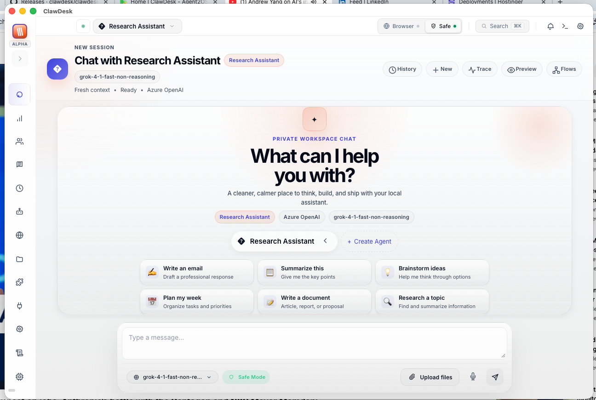

The **Chat** page is where you spend most of your time. Type a message, pick an AI model, and get a response — it's that simple.

**What you see:**
- **Message area** in the center with your conversation history
- **Model picker** at the top to switch between AI models (Claude, GPT-4, Gemini, etc.)
- **Message input** at the bottom with attachment and voice buttons
- **Sidebar** on the left for navigating to other pages

This is your main workspace. Send messages, attach files, switch models mid-conversation, and even use voice input. The AI streams responses in real time — you see words appear as they're generated.

---

## 2. Overview — Your Dashboard

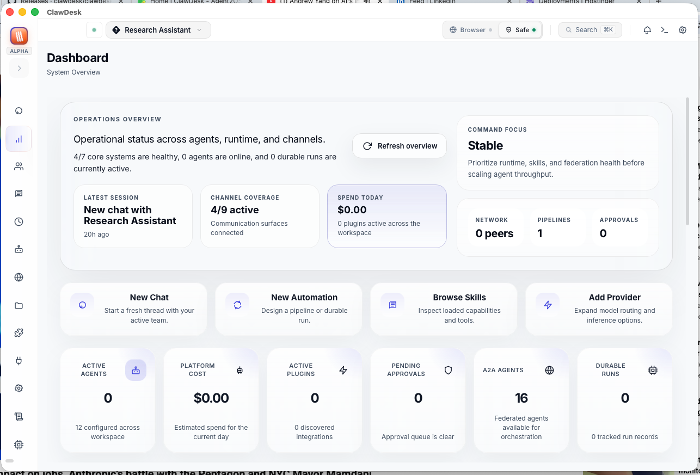

The **Overview** page gives you a bird's-eye view of everything happening in ClawDesk.

**What you see:**
- **Health ring** showing the status of all subsystems
- **Active agents** count and their current state
- **Connected channels** (Telegram, Discord, etc.)
- **Cost metrics** tracking your AI provider usage
- **Quick links** to jump to any section

Think of this as your mission control — one glance tells you if everything is running smoothly.

---

## 3. A2A Directory — Agent-to-Agent Network

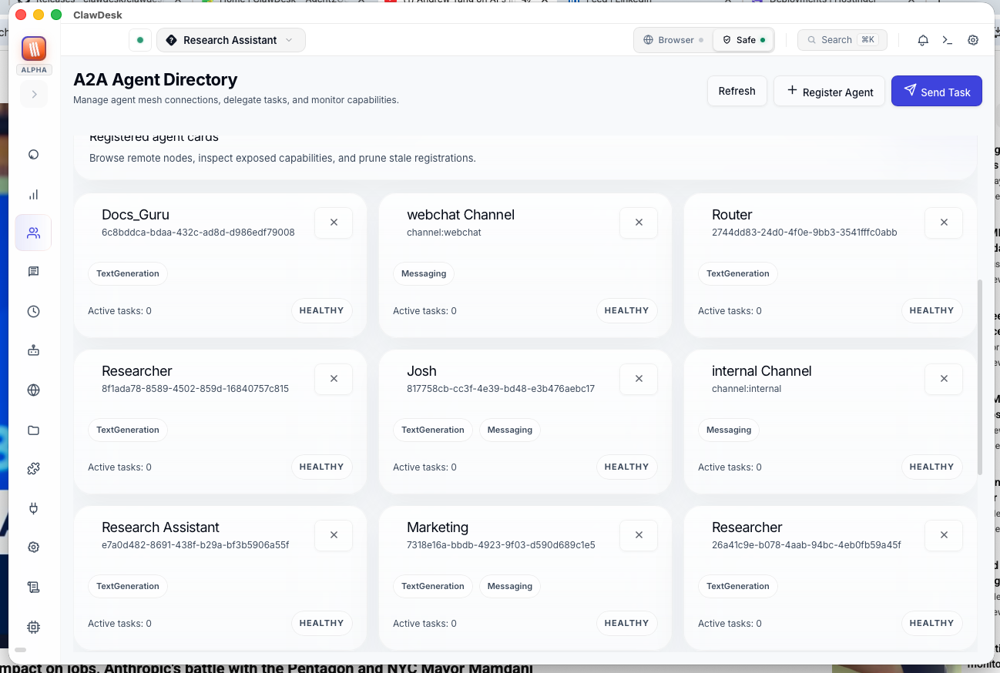

The **A2A Directory** manages agent-to-agent communication using the A2A protocol.

**What you see:**
- **Agent directory** listing federated agents
- **Agent cards** showing capabilities and status
- **Task history** of inter-agent communications

This is an advanced feature for users who want multiple AI agents to talk to each other and collaborate on tasks.

---

## 4. Skills — Abilities for Your Agents

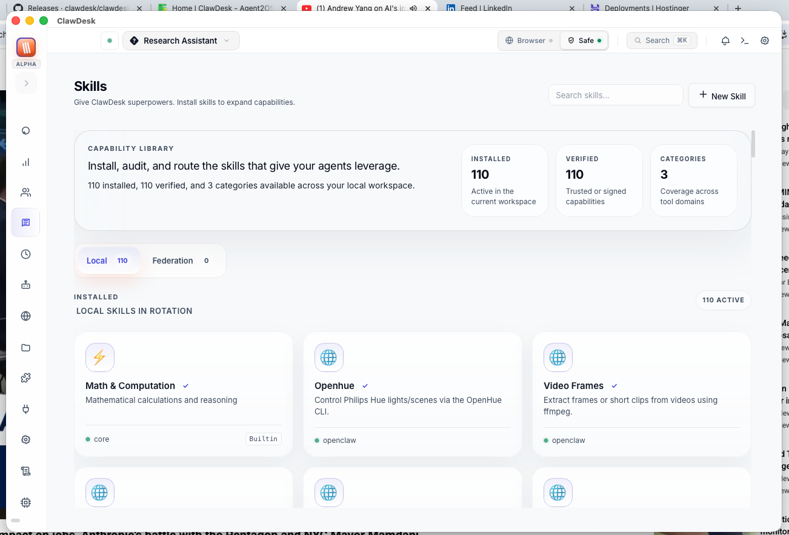

The **Skills** page is your catalog of abilities you can give to your agents.

**What you see:**
- **Skill cards** with names, descriptions, and trust badges
- **Install/Try** buttons for each skill
- **Categories** to filter skills by type
- **Verification badges** showing which skills are trusted

Skills are like apps for your agents — web search, code execution, file reading, and more. Browse, install, and assign them to any agent.

---

## 5. Scheduled Jobs — Automation Center

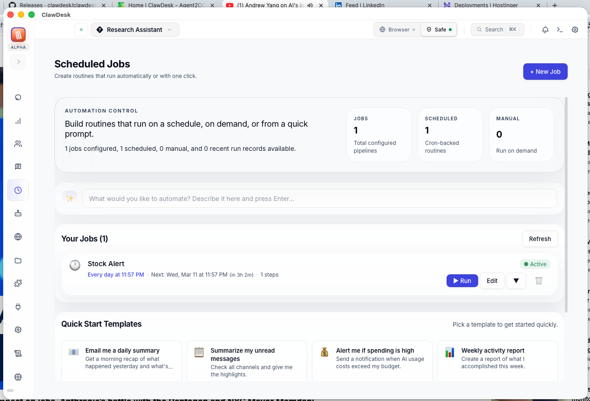

The **Scheduled Jobs** page lets you set up tasks that run automatically on a schedule.

**What you see:**
- **Job list** with names, schedules, and status
- **Templates** for quick setup (daily summaries, weekly reports, etc.)
- **Visual pipeline editor** (DAG canvas) for complex workflows
- **Cron schedule display** showing when each job runs

Set it and forget it — get your morning news briefing at 8 AM, weekly reports on Friday, or any other automation you can imagine.

---

## 6. Agents — Your AI Team

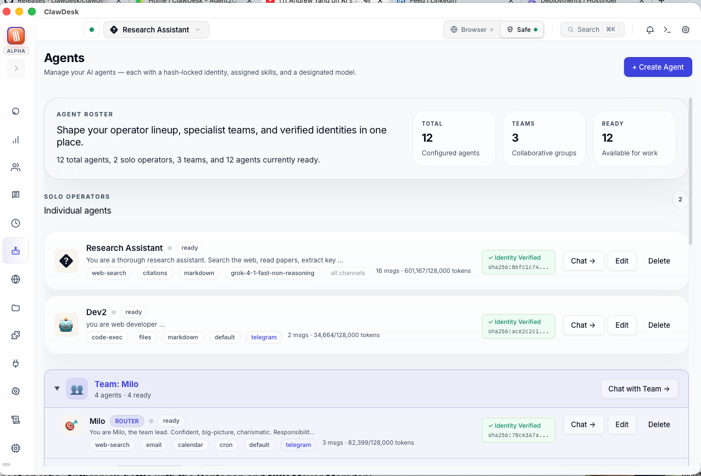

The **Agents** page is where you create and manage your specialized AI assistants.

**What you see:**
- **Agent roster** listing all your agents
- **Agent details** including name, model, and personality
- **Team builder** for creating agent teams
- **Create button** to make new agents

Each agent has its own personality, instructions, and skills. Create a "Writing Coach," a "Python Tutor," a "Research Assistant" — whatever you need. You can even build teams where agents collaborate.

---

## 7. Channels — Connect Your Apps

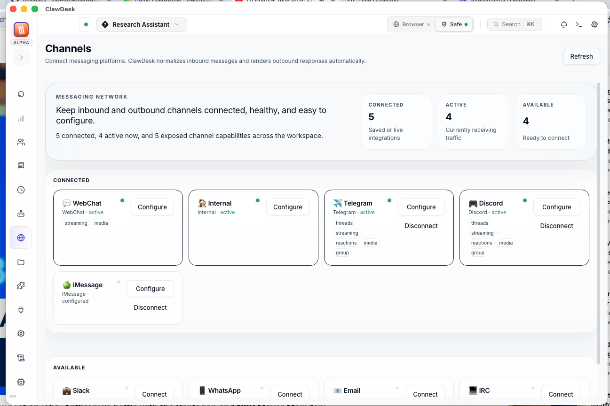

The **Channels** page connects ClawDesk to your messaging platforms.

**What you see:**
- **Channel list** with connection status (green = connected)
- **Supported platforms** (Telegram, Discord, Slack, WhatsApp, etc.)
- **Configuration fields** for tokens and credentials
- **Capability indicators** showing what each channel supports

Connect your Telegram bot, Discord server, or Slack workspace so your AI agents can respond to messages there automatically.

---

## 8. Extensions — Integrations & Tools

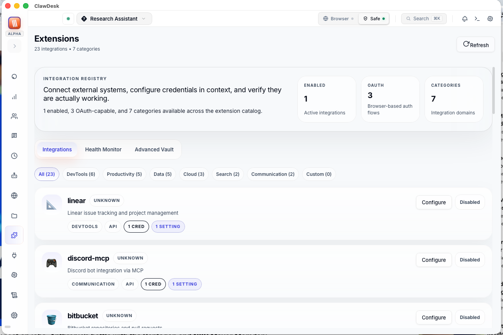

The **Extensions** page manages third-party integrations.

**What you see:**
- **Integrations tab** with configured extensions
- **Health monitoring** showing connection status
- **Credential vault** for secure API key storage
- **Add integration** button for new connections

Extensions connect ClawDesk to external services — GitHub, calendars, databases, and more. Your agents can use these integrations as tools.

---

## 9. MCP — Model Context Protocol

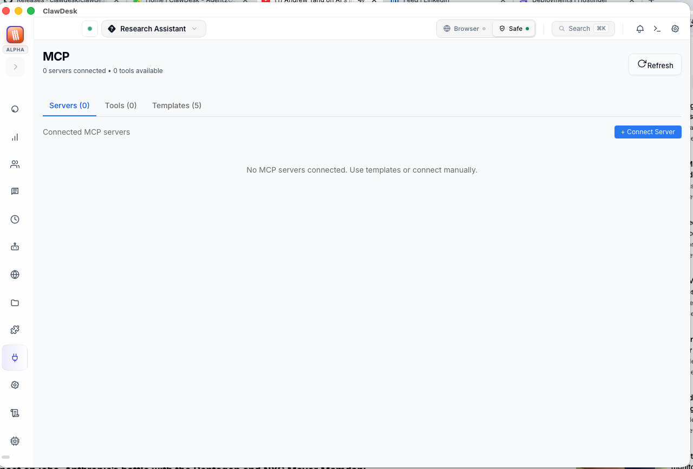

The **MCP** page manages Model Context Protocol servers that give your agents tools.

**What you see:**
- **Connected servers** with their status
- **Available tools** exposed by each server
- **Templates** for quick setup of common tools
- **Connection settings** (stdio or SSE transport)

MCP is the standard way to give AI models access to external tools. Connect an MCP server and your agents automatically gain new abilities.

---

## 10. Settings — Configure Everything

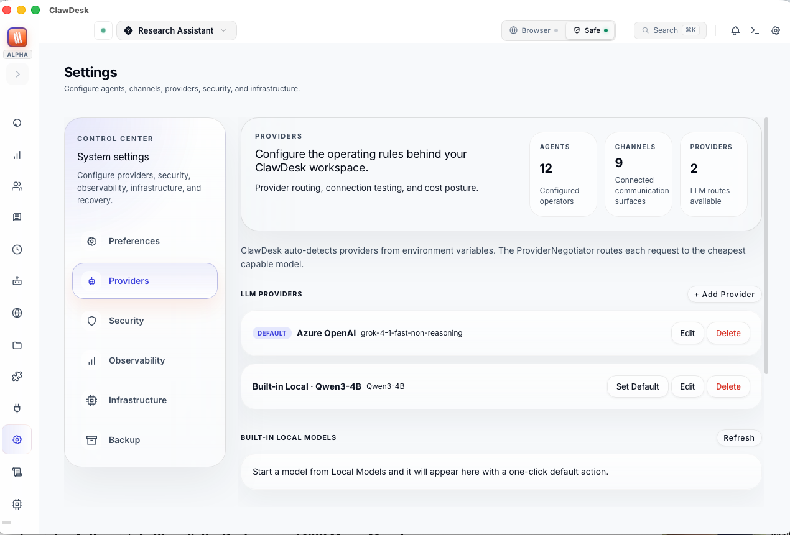

The **Settings** page is your configuration hub with multiple tabs.

**What you see:**
- **Providers tab** — Add API keys for Claude, ChatGPT, Gemini, etc.
- **Preferences** — Appearance and behavior settings
- **Security** — Access controls and content scanning
- **Observability** — Performance charts and metrics
- **Infrastructure** — Advanced system settings
- **Backup** — Export and import your configuration

The most important tab is **Providers** — this is where you add your AI API keys to start chatting.

---

## 11. Logs — What's Happening Behind the Scenes

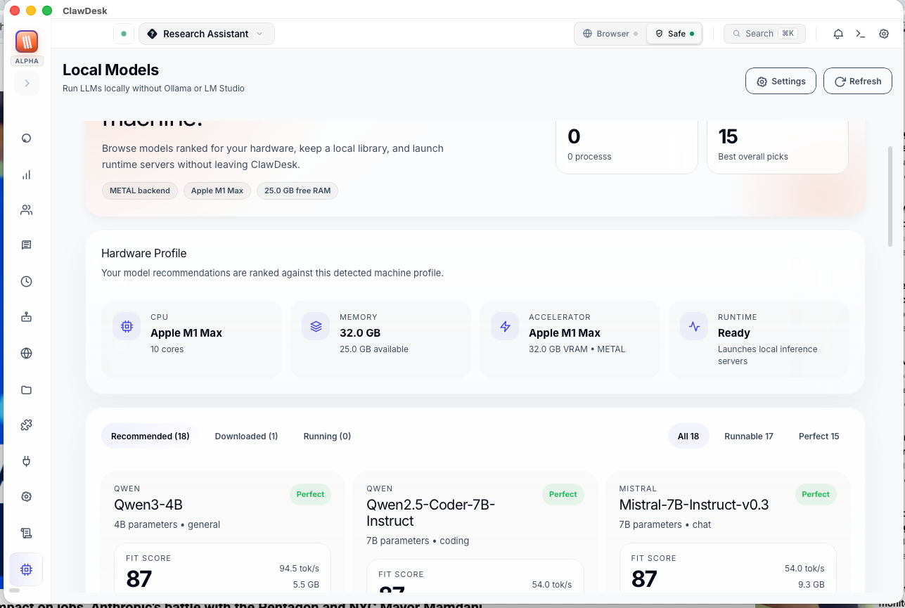

The **Logs** page shows real-time activity and error information.

**What you see:**
- **Log entries** with timestamps and severity levels
- **Filter controls** (debug, info, warn, error)
- **Search bar** to find specific events
- **Auto-follow** toggle to keep scrolling to the latest entries

Useful for debugging when something isn't working right. Check here for error messages, connection issues, or to see what your agents are doing.

---

## 12. Local Models — Run AI on Your Computer

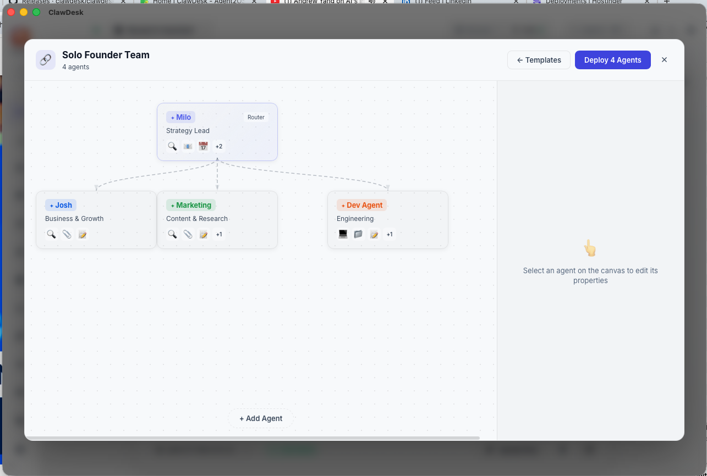

The **Local Models** page lets you download and run AI models directly on your machine.

**What you see:**
- **System information** showing your hardware capabilities
- **Recommended models** with fit scores (Perfect, Good, Marginal)
- **Download progress** for models being downloaded
- **Start/Stop controls** for running models
- **Memory usage** indicators

This is where the magic of offline AI happens. Download a model, click Start, and chat with AI completely for free — no internet, no API keys, no monthly bills. ClawDesk detects your hardware and recommends models that will run well on your system.

---

## Architecture Diagrams

### Gateway Flow

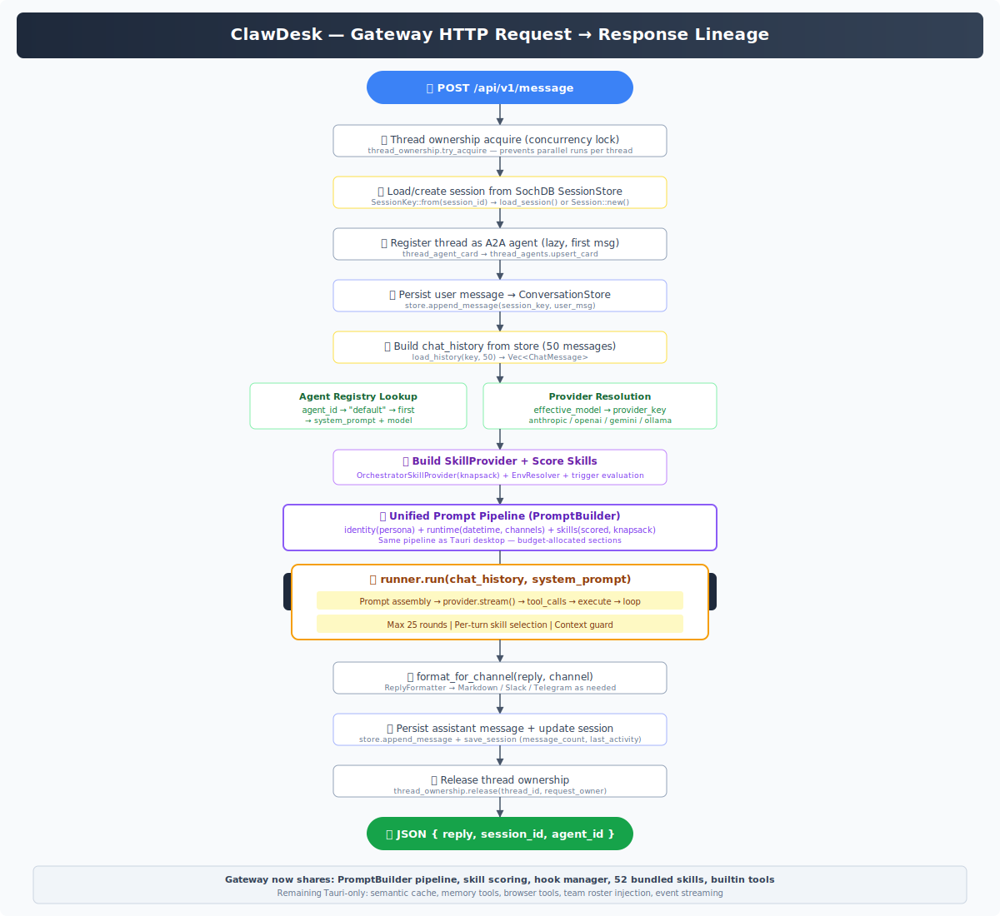

How messages flow through the ClawDesk gateway — from incoming channel messages through agent processing to AI provider responses.

### Tauri Desktop Flow

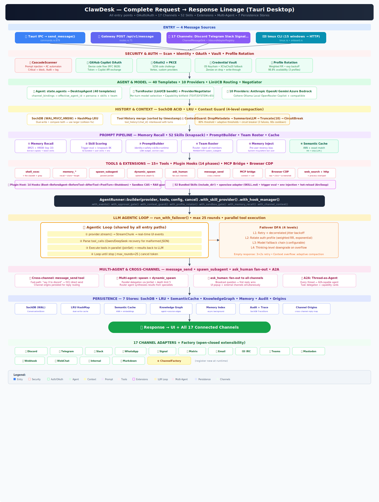

How the desktop app works — the Tauri 2.0 architecture connecting the React frontend to the Rust backend through IPC commands.
